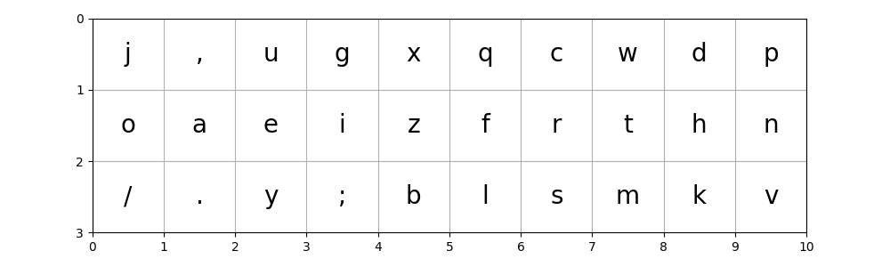

# quantum_keymap
Keymap generator using simulated quantum annealing.

## Sample result



## Install
install libraries with poetry.

```shell
$ pip install poetry
$ poetry install
```

## Run

```shell
$ poetry run python -m quantum_keymap
```

Results are saved into `result/`.

Changing parameters in `quantum_keymap/__main__.py` is recommended.
